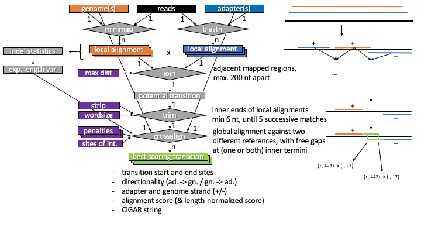

# crossalign

Crossalign searches read data for transitions between two sets of reference sequences.

## description

When sequencing transposon mutant libraries, ligation products or DNA samples of recombination experiments, sequencing reads may consist of two or more parts of different, known reference sequences, e.g. a genomic sequence and a plasmid harboring a transposable element. Common reference mapping tools may have difficulties identifying the exact transition sites due to random sequence identity near the transition site and/or insufficient quality of individual sequencing reads. Based on separately performed reference mappings against two sets of reference sequences, crossalign identifies alignments against different references that are in close proximity to each other with respect to the read sequence. It then trims the alignment termini and then performes an additional alignment step - the "crossalignment" - of the read sequence in between against both references simultaneously to find the most probable transition site. In case multiple different transition sites are producing the same, highest alignment score given the penalty parameters, all potential transition sites are found together with their respective CIGAR strings. If the transition site is known a priori for any given reference sequence, it can be passed to crossalign in order to reduce ambiguity and the amount of results produced since only the transition site in the other sequence is left as a free variable.



## installation

Create an anaconda3 environment with all the required software.

```
conda env create -f environment.yml
conda activate crossalign
```

Clone and build crossalign.

```
git clone https://github.com/MarkusHaak/crossalign.git
cd crossalign
make
```

Test that everything works as expected.

```
python tests.py
```

## usage

In the most basic usage case, just pass a fastq file containing the sequencing reads and two (multiple-) fasta files with two sets of reference sequences to crossalign. An optional output prefix is specified. The names "adapter" and "genome" were chosen due to the original application case and are of no importance.

```
> python crossalign.py --reads reads.fastq --adapter references1.fasta --genome references2.fasta --prefix out
```

The script will output alignment results against the two reference sets (out.adapter_alignment.paf, out.genome_alignment.paf) and the crossalign results as text output (out.alignment.csv) and as a pickled pandas dataframe (out.alignment.df.pkl) containing all information.

The user can choose from minimap2 and blastn (for short sequence matches) as the alignment tool for the initial alignments (--adapter_alignment_tool, --genome_alignment_tool). Alternatively, the alignments can be performed separately and the results passed to crossalign as .paf or sorted and indexed .bam files:

```
> python crossalign.py --reads reads.fastq --adapter references1.fasta --genome references2.fasta --prefix out --adapter_alignment ad_alignment.bam --genome_alignment gn_alignment.bam 
```

For applications where the transition site(s) is known for certain reference sequences, e.g. the end of an inverted repeat, but unknown for the other set of reference sequences, e.g. a genome, it is useful to pass a list of "sites of interest" to crossalign.
	
```
> cat soi.tsv
ref1	+	234
> python crossalign.py --reads reads.fastq --adapter references1.fasta --genome references2.fasta --prefix out --sites_of_interest soi.tsv
```

In this case, crossalign would return only transitions from the (+) strand of the reference sequence with id "ref1" at site 234 to any site in any other reference sequence. These could be reads with transitions of the following categories: 5' ref1 (+) @ 234 -> <refX> (+/-) @ <N> 3' OR 5' <refX> (+/-) @ <N> -> ref1 (-) @ 234 3'

## output

Following is a short description of all output fields in the <prefix>.alignment.csv text output:

```
rid		: read sequence id 
order		: order of reference mappings in the read sequence, 
		  either "1" (5' adapter (+/-) -> genome (+/-) 3') 
		  or "-1" (5' genome (+/-) -> adapter (+/-) 3')
subj_ad		: sequence id of the aligned adapter reference sequence 
strand_ad	: aligned strand of the adapter reference sequence (+/-)
subj_gn		: sequence id of the aligned genome reference sequence 
strand_gn	: aligned strand of the genome reference sequence (+/-)
ts		: transition start, 0-based index of first non-aligning base (+) 
		  or last aligning base (-) in the upstream reference sequence
te		: transition start, 0-based index (+) or 1-based index (-) 
		  of first aligning base in the downstream reference sequence
cigar		: CIGAR string produced by crossalign
score		: score of the cross-alignment
norm_score	: length-normalized alignment score:  score / (qlen * match) 
		  where "qlen" is the query length and "match" is the match reward
amb		: ambiguity flag, True if more than one highest scoring alignment 
		  with different transitions is produced
qst_ad		: query start of the initial adapter reference mapping
qen_ad		: query end of the initial adapter reference mapping
sst_ad		: subject start of the initial adapter reference mapping
sen_ad		: subject end of the initial adapter reference mapping
qst_gn		: query start of the initial genome reference mapping
qen_gn		: query end of the initial genome reference mapping
sst_gn		: subject start of the initial genome reference mapping
sen_gn		: subject end of the initial genome reference mapping
```

The following list of examples of all possible transition orders and strand combinations are given to clarify which values "ts" and "te" will take on for certain transitions.
Let the reference sequences in the adapter and genome set be the following 10 bp sequences:

```
0-based index  :     0    5    
adapter_seq    :  5' ATATAGCGCG 3'
genome_seq     :  5' CCGGCTTAAT 3'
```

| read sequence | order | strand_ad | strand_gn | ts | te 
| ------------- |-:|:-:|:-:|-:|-:|
| ```ATATATTAAT```    | 1 | + | + | 5 | 5
| ```ATATAGCCGG```    | 1 | + | - | 5 | 5
| ```CGCGCGCCGG```    | 1 | - | - | 5 | 5
| ```CGCGCTTAAT```    | 1 | - | + | 5 | 5
| ```CCGGCGCGCG```    | -1 | + | + | 5 | 5
| ```CCGGCTATAT```    | -1 | + | - | 5 | 5
| ```ATTAATATAT```    | -1 | - | - | 5 | 5
| ```ATTAAGCGCG```    | -1 | - | + | 5 | 5


In addition, a binary <prefix>.alignment.df.pkl file is created, containing the pandas DataFrame with all gathered information. This can be used for more detailed analysis. As an example, the following code snippet shows how to read all sequence data and the DataFrame in a python interpreter and pretty-print the transitions at location 234,423 on the (+) strand of the adapter reference sequence with id "ref1":

```
>>> from crossalign import *
>>> read_sequence_data("reads.fastq", "adapter.fasta", "genome.fasta")
>>> df = pd.read_pickle("prefix.alignment.df.pkl").explode('transitions')
>>> sel =  (df.order == 1) & (df.strand_ad == '+')     # ref1 ('+')   -> <refX> (+/-)
>>> sel |= (df.order == -1) & (df.strand_ad == '-')    # <refX> (+/-) -> ref1 ('-')
>>> sel &= (df.subj_ad == "ref1")
>>> d_sel = df.loc[sel].explode('transitions')
>>> d_sel = d_sel.loc[(d_sel.transitions.str[0] == 234423)]
>>> verbose(d_sel)

"ref1" (+) @234423 -> "ref2" (+) @9812 , norm_score 1.0
query: read_1323
ref1:  GGAT    
       ||||    
query: GGATCGGT
           ||||
ref2:  aattCGGT

"ref1" (+) @234423 -> "ref2" (-) @49193 , norm_score 0.5
query: read_4535
ref1:  -AACGCAAGGATtaatg
       I|||||D||X||     
query: AAaCGC-AGtATGGCTA
                   |||||
ref2:  ttaaattaatgcGGCTA

...
```
